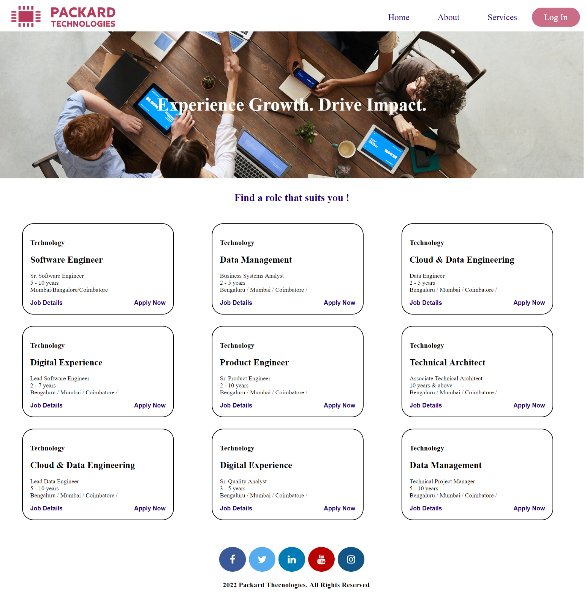

# What Is This Project About?

## Introduction 

A Simple Job Application Website aims in creating a user friendly environment for users to apply for their desiring job 
The website takes responses form the user which could be seen by the administrator 
The Job Application Site has been designed using Django which is a module under Python

<!--  -->


This project contains login authentication system for users and an user friendly job application interface.
Admin can view the user profile and the respective job applications filled by the users.


## Run the Following commands before running the server.

For installing the necessary packages.
```bash
pip install -r requirements.txt
```

Apply Migrations

```
python manage.py makemigrations
```
Migrate the server 
```
python manage.py migrate
```
Create a SuperUser 
```
python manage.py createsuperuser
```
Add the respective details for the same.
##
Run the Server 
```
python manage.py runserver
```

Now the you should be able to see the site on your localhost server .... 

## Images For Our Site

### Home Page




